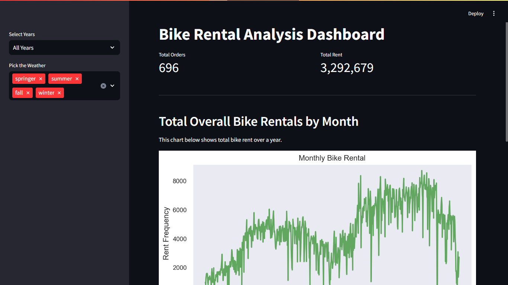

# Bike Rent Analysis



## Dashboard Installation
To setup the dashboard, run the following command

### Clon the Repository
```
git clone https://github.com/zadanfai/bike-rent-analysis.git
```
```
cd bike-rent-analysis
```

### Install requirements
Make sure you have python=3.7 or higher installed 
```
pip install -r requirements.txt
```

### Run steamlit app
```
streamlit run dashboarad/dashboard.py
```

## Having trouble with protobuf?
For windows
```
set PROTOCOL_BUFFERS_PYTHON_IMPLEMENTATION=python
```

For Linux/mac OS
```
export PROTOCOL_BUFFERS_PYTHON_IMPLEMENTATION=python
```